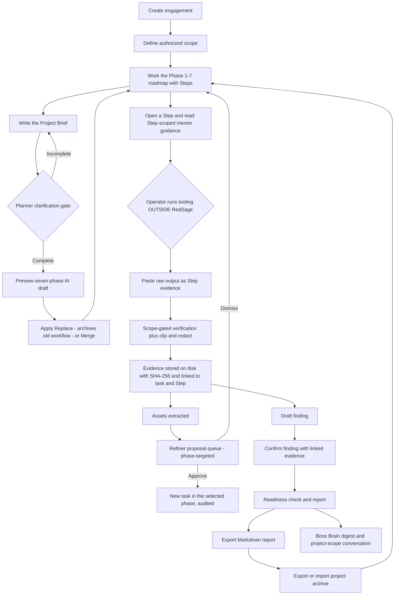

# RedSage v2 — Product Overview

## What RedSage is

RedSage v2 is a local-first, single-operator, human-in-the-loop penetration-testing and audit workflow companion. The operator performs every action manually outside the application — RedSage never executes tools, launches scans, opens sockets to targets, or automates attacks. Instead, it provides the governed workflow around the work: it manages authorization scope (whitelist/blacklist, lock, and audited amendments), captures a **Project Brief** and can generate a tailored **seven-phase workflow** (with a clarification gate and a deterministic offline fallback), seeds a seven-phase assessment methodology with display-only command templates, breaks tasks into guided **Steps**, accepts pasted tool output as evidence, stores that evidence as atomic disk artifacts with SHA-256 integrity metadata, verifies it against the task/Step objective (optionally with Cohere), extracts discovered assets, proposes governed follow-up tasks into the Refiner-selected phase, tracks findings through a draft-to-confirmed lifecycle with an evidence gate, persists mentor conversations, provides a read-only **Boss Brain** status digest, and compiles audit-ready Markdown reports plus portable project archives. The backend is a FastAPI application (`backend/main.py`, version `2.0.0-mvp`) backed by SQLite and a per-project artifact directory; the frontend is a React + Vite single-page workspace served either by Vite in dev mode or directly by FastAPI from `frontend/dist` (UI brand `REDSAGE v2 / V1.1`).

## Who it's for

- **Penetration testers and red-team operators** who work under explicit written authorization and need a disciplined way to capture, verify, and report what they did without another tool touching the target on their behalf.
- **Security consultants and auditors** who deliver client-facing engagement documentation and need traceability from scope attestation and amendments through evidence digests to confirmed findings.
- **Solo practitioners and small security teams** who want a local-first workspace (SQLite + disk artifacts, no accounts, no telemetry) that can run fully offline and only optionally calls an AI provider for verification and mentoring.

## Core workflow loop

1. **Create engagement** — `POST /api/v1/projects` creates the project, an empty scope, and seeds the baseline methodology.
2. **Define authorized scope** — set the whitelist (and optionally blacklist and rate limit) with `PUT …/scope`.
3. **Lock scope** — `POST …/scope/lock`; this is the gate for evidence verification and the audited baseline for all later changes.
4. **Write the Project Brief** — a free-text engagement description stored per project (`PUT …/brief`).
5. **Plan the workflow** — the Planner runs a clarification gate; if the brief is incomplete it returns bounded questions and no draft, otherwise it returns a seven-phase draft (AI-tailored, or the deterministic baseline when no key is configured). Nothing is live until **Apply Replace** (archives old Tasks/Steps in place) or **Apply Merge** (title-deduplicated).
6. **Work the roadmap** — select tasks from the seven phases; tasks can be expanded into manually managed **Steps**, each with its own objective, completion criteria, and expected evidence type.
7. **Operator runs tooling outside RedSage** — the human performs the work against authorized targets only.
8. **Paste evidence** — raw output goes into the Evidence tray at task or Step level; the app never executes it.
9. **Verify (scope-gated)** — the server clips and redacts the text, then verifies against the task/Step objective; verification is refused while the scope is unlocked, and a task with Steps delegates verification to its Steps.
10. **Evidence persists** — the raw text is written atomically to `data/projects/{project_id}/artifacts/` with size and SHA-256 before any AI call; SQLite keeps metadata plus a redacted excerpt, linked to the parent task and (when applicable) the Step.
11. **Assets extracted** — hosts, ports, endpoints, and files named in the evidence are recorded (deduplicated per project).
12. **Proposals** — keyword-bearing or asset-derived follow-ups enter a capped queue as PENDING proposals; the Refiner chooses a canonical target phase (safe default Phase 4), and the human approves or dismisses.
13. **Draft finding** — capture a potential issue with no evidence requirement.
14. **Confirm finding** — requires a valid linked evidence record from the same project plus description and reproduction steps.
15. **Readiness** — a scored panel lists critical issues, warnings, and per-phase coverage.
16. **Report** — Markdown report with scope attestation, methodology matrix, assets, confirmed findings, and the Evidence Register appendix.
17. **Export/import** — a checksummed ZIP carries one project (data, artifacts, report snapshot) to another location or machine, with all IDs remapped on import.
18. **Boss Brain** — a read-only digest (per-phase coverage from the same readiness function, asset counts, confirmed findings) plus a project-scope AI conversation grounded in those measured numbers.

## Key features

### Scope and authorization control
- One scope row per project: whitelist, blacklist, max rate limit (default 10, range 1–1000), and lock state.
- Target validation accepts IP networks, domain-shaped names, and the literals `localhost`, `target.local`, `juice-shop.local`.
- Locking requires at least one whitelisted target and writes a `SCOPE_LOCKED` audit event with `locked_at`.
- Direct scope edits are rejected after locking; the supported post-lock path is an amendment with new targets, a named authorizer, a rationale of at least 10 characters, case-insensitive deduplication, and a permanent `scope_amendments` + `SCOPE_AMENDED` audit trail.
- Task command resolution and the AI mentor refuse any target that is not whitelisted (HTTP 422).

### Guided methodology and task roadmap
- New projects are seeded from `data/methodologies/baseline_methodology.json` with **7 phases × 2 tasks = 14 tasks** (Pre-engagement through Reporting).
- The **Planner** can generate a project-specific seven-phase workflow from the Project Brief. It enforces a deterministic clarification gate (no draft until the brief is complete), validates output against the exact canonical phase list, and never applies a draft automatically. With no key or on provider error it returns the baseline reshaped one Step per Task.
- Tasks can be expanded into **Steps** with their own objective, why-it-matters, completion criteria, expected evidence type, state, and justification. A Step-bearing task is completed only by rollup when all active Steps reach a terminal state.
- **Apply Replace** archives existing Tasks and Steps in place (preserving IDs and Evidence links); **Apply Merge** appends only new exact titles.
- Only Phase 2 (Intelligence Gathering) and Phase 4 (Vulnerability Analysis) carry non-intrusive command templates; Phase 5 and 6 are planning/documentation-only with no commands, and the seed data contains no exploit payloads.
- The API returns each task's raw `command_template`, a server-resolved `resolved_command` (substituting `{target_host}` and `{rate_limit}`), and an `is_scope_safe` flag computed for the active target and lock state.
- Commands are display-only guidance for the human; RedSage never runs them.

### Evidence capture, storage, and verification
- Paste up to 2,000,000 characters per submission (`POST …/tasks/{task_id}/verify`, or `POST …/tasks/{task_id}/steps/{step_id}/verify` at Step level); scope must be locked.
- Verification is optional-AI: with a Cohere key the log is clipped to 80 lines, regex-redacted, XML-bounded as `<untrusted_evidence_log>`, and validated against a strict four-verdict schema (`PASS`, `FAIL`, `AMBIGUOUS`, `CONFIRMED_NEGATIVE`); without a key the deterministic offline verifier returns **AMBIGUOUS/LOW** and never auto-completes work; any provider failure also degrades to AMBIGUOUS/LOW instead of an error.
- A validated live `PASS` completes the task or Step; `CONFIRMED_NEGATIVE` sets that status with the AI summary as justification; `FAIL`/`AMBIGUOUS` (including offline) leave the status untouched but the evidence is still stored.
- Once a task has active Steps, the task-level verify route returns **409** — verification is owned by the Steps, so there is one source of truth. Step completion rolls up to task completion only when every active Step is terminal.
- The raw artifact is written atomically (temp file → fsync → rename) and identified by a random `EVID-XXXXXXXXXX` ID; SQLite stores `file_path`, `file_size_bytes`, `sha256_hash`, and a redacted excerpt (~800 chars), never the full raw text.
- The Evidence Library shows every artifact with its digest (copyable), size, timestamp, source task (and Step when present), redacted excerpt, and a full-artifact viewer.

### Workflow proposals (human-approved)
- Two generation paths: keyword triggers during verification (`backup`, `admin`, `zip`, `.env`, `config`, `graphql` in an extracted asset value) and asset-driven suggestions (`POST …/assets/{asset_id}/suggest-tasks`).
- The **Refiner** selects a target phase from the canonical seven; no-key, provider-error, malformed, or invalid-phase output safely defaults to `Phase 4: Vulnerability Analysis`.
- The pending queue is capped at 5; suggestions are deduplicated against existing proposals and against all task/proposal titles.
- Approval creates a real task in the project phase whose name **exactly matches** `proposal.phase_name` (missing phase → 400); dismissal hides the proposal without an audit event; undo is allowed only while the created task is still `NOT_STARTED` with no linked evidence, and restores the proposal to PENDING.
- The audit log recomputes undo eligibility server-side and surfaces an "Undo Addition" action only where it currently applies.

### Findings lifecycle
- `POST …/findings` always creates a DRAFT; evidence is optional for drafts, but any supplied evidence ID must belong to the same project.
- `POST …/findings/{id}/confirm` requires a valid same-project evidence ID plus non-empty title, severity (LOW/MEDIUM/HIGH/CRITICAL/INFO), description, and reproduction steps; the confirm form is also the only field-update path.
- Only CONFIRMED findings enter the report; DRAFT findings are ignored by the readiness score entirely.
- There is no delete, un-confirm, or general edit route.

### Report Studio
- Markdown report assembled from database rows only (never re-reading raw artifacts), with Executive Summary, Scope & Rules-of-Engagement Attestation (including the amendments table), Methodology & Task Execution Matrix, Target Asset Inventory, Confirmed Findings (each with `Evidence Ref`), and the Evidence Register appendix.
- `GET …/report` returns `{markdown}`; `GET …/report/download` streams an attachment.
- Readiness endpoint returns `ready_for_export`, a score (`100 − 30·critical − 10·warning`, floored at 0), issue objects, and per-phase coverage percentages.

### Export / import
- `GET …/export` produces a ZIP containing `manifest.json` (format `1.0`, counts, per-member SHA-256), `db/project_data.json` (all rows of exactly one project), every evidence artifact, and a freshly generated `reports/report.md`.
- Limits: archive ≤ 100 MB, ≤ 1,000 members, ≤ 10 MB per member, ≤ 100 MB uncompressed; a missing artifact at export returns 409.
- `POST /projects/import` validates ZIP member paths (zip-slip/absolute-path rejection), manifest version, required members, and every checksum before writing; it mints a new project ID and new IDs for every row, remaps foreign keys and audit references, re-mints evidence IDs, recomputes size/hash from the extracted bytes, and rolls back plus removes only the new project directory on failure. Existing projects are never overwritten.

### AI mentor and Boss Brain
- Four modes — Teach, Guide, Verify, Summarize — invoked per task or Step; the context pack contains task/Step/scope/active target, top assets, top confirmed findings, and the latest redacted excerpts for that scope (raw artifacts are never read), hard-capped at 8,000 characters.
- The mentor system prompt forbids exploit payloads and step-by-step compromise instructions, treats all context as untrusted inert data, and declines out-of-scope guidance.
- Without a key or on provider failure it returns a mode-specific static checklist with `ai_available: false` rather than an error.
- Conversations are **persisted** in `mentor_messages`, scoped to project + task + optional Step, and reload across restarts. User turns are redacted and clipped before storage. Audit events record mode, availability, and question length — never content.
- **Boss Brain**: a read-only project digest plus a project-scope conversation (`POST …/mentor/boss`, history `GET …/mentor/boss/history`, persisted with `task_id=NULL`/`step_id=NULL`). Digest coverage is computed by the exact same function as Report Readiness, so the numbers never drift.

## Safety posture

- **Authorized testing only.** Scope must be defined, validated, and locked before verification; amendments require a named authorizer and rationale and are permanently audited. The report attestation and amendment table document exactly what was authorized. These controls are workflow guards, not a substitute for legal authorization or network-level controls.
- **No tool execution, ever.** RedSage does not run commands, scans, or exploits. Resolved commands are inert strings rendered for the human to read; Phase 5/6 methodology content is planning and documentation only. Every action against a target is performed manually outside the app by the operator.
- **Untrusted evidence handling.** Pasted logs are treated as hostile target/tool output. They are clipped and redacted in memory, wrapped in an `<untrusted_evidence_log>` boundary, and the verifier is instructed to ignore embedded instructions and never echo demanded markers. The mentor receives only redacted excerpts, never raw artifacts.
- **Redaction before storage and before AI.** Ten regex families cover bearer tokens, basic-auth credentials, JWTs, password assignments and CLI flags, authorization headers, secret/api-key/token key-value pairs, private-key blocks, and database connection strings; URL-encoded text is decoded once and re-checked. The database keeps only the redacted excerpt; the full raw artifact stays on local disk.
- **Safe degradation.** AI provider outages never produce HTTP 500 from the verifier or mentor: verification returns AMBIGUOUS/LOW with the evidence already stored, and the mentor returns a static checklist.
- **Local-first boundaries.** Endpoints are unauthenticated by design for a single-operator localhost tool. Bind to `127.0.0.1`, treat the SQLite database and `data/projects/` as sensitive engagement data, and do not expose the service to untrusted networks. With no API key configured, nothing leaves the machine.

## Known limitations

Derived from `EXPLANATION.md` §8.1 (the ground-truth system explanation); the implementation, not the plan, is authoritative.

- **Offline verdicts are always AMBIGUOUS/LOW and never auto-complete.** The deterministic no-key verifier stores the artifact and extracts safe assets but cannot produce PASS, FAIL, or CONFIRMED_NEGATIVE; those verdicts require a live provider (the provider-*failure* path also downgrades to AMBIGUOUS/LOW).
- **Single-operator by design.** No authentication or authorization on any endpoint; SQLite runs in default rollback-journal mode with no WAL or busy-timeout pragmas. Concurrent multi-client use is out of scope.
- **Mentor conversations are persisted** in `mentor_messages` and exported/imported with the project archive (scoped per project/task/optional-Step, plus project-scope Boss threads). They are not streamed: each request is a synchronous 5–15 s round trip with no rate limiting beyond the 4,000-character message cap.
- **The Active Target is UI state, not server-persisted.** It is passed per request as `?target_host=`, defaults to the first whitelist entry when absent, and resets when you switch, create, or import a project.
- **Existing projects are not migrated to the 7-phase methodology.** Only newly created projects receive the full phase set; older projects keep whatever phases they were seeded with.
- **Proposal queue cap is 5, and deduplication is exact-string** on `target_asset` or title — no fuzzy matching or hashing.
- **Justification thresholds differ by layer.** The task-state API requires ≥ 5 non-space characters for SKIPPED/CONFIRMED_NEGATIVE; report readiness warns below 10.
- **Report task ordering uses the global `order_index`**, not phase grouping, so tasks from different phases can interleave in the execution matrix.
- **Proposal phase targeting is exact-name.** Approval matches `Phase.name == proposal.phase_name`; if the named phase does not exist, approval returns 400 rather than silently rerouting. The Refiner defaults to Phase 4 on unavailable or invalid AI output.
- **Findings cannot be edited after creation** except through the confirm-form update path; there is no delete or un-confirm route.
- **The frontend API base is hardcoded** to `http://127.0.0.1:8000/api/v1` (in `api.ts` and again in `EvidenceModal.tsx`), and CORS whitelists only the two port-5173 dev origins — moving the backend or serving the UI from another origin breaks the UI.
- **Search is capped at 5 results per category using `ilike`** with no ranking, pagination, or full-text index; evidence lists and audit logs are unpaginated.
- **Evidence IDs are random** (`EVID-<10 hex>`), not sequential, and `read_artifact`'s 10 MB size-limit error message still says "5 MB".
- **Import remaps only known entity types.** Audit events with an unmapped `entity_type` keep their original `entity_id` (a dangling reference by design).
- **Legacy components are preserved but unused by the backend:** `core/` (ChromaDB knowledge base), `interfaces/` (legacy KB API + MCP server), `data/chroma/`, and the `Evidence.raw_content` column. `chromadb` and `mcp` remain in `requirements.txt`.
- **Live AI benchmark tests are opt-in** and skipped by default to avoid paid API calls; deprecated-API warnings appear in the test suite (FastAPI startup hook, `datetime.utcnow()`, Starlette/httpx/Cohere SDK deprecations) and Vite prints a non-blocking ESM/CJS config warning.

---

*Last verified against version 2.0.0-mvp (UI v2 / V1.1) on 2026-09-10. Ground truth: `EXPLANATION.md` as of 2026-09-08 plus direct reads of `backend/**` and `frontend/src/**`.*
